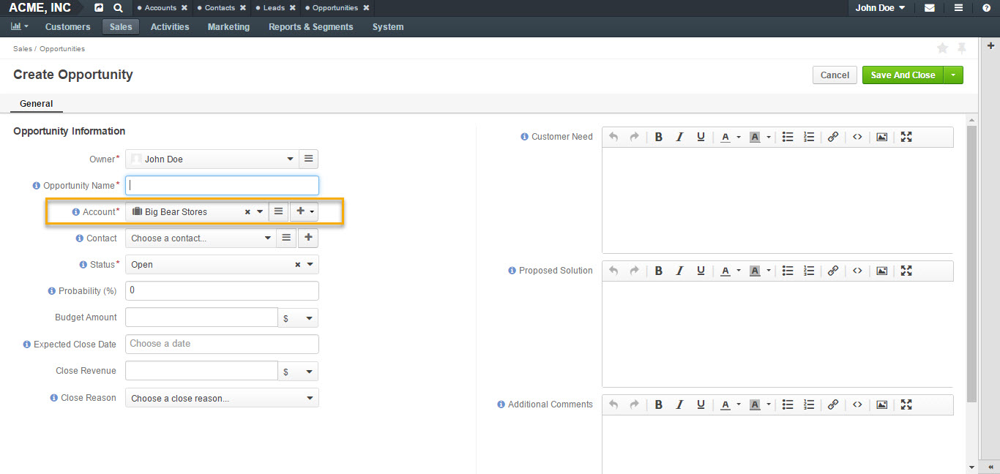
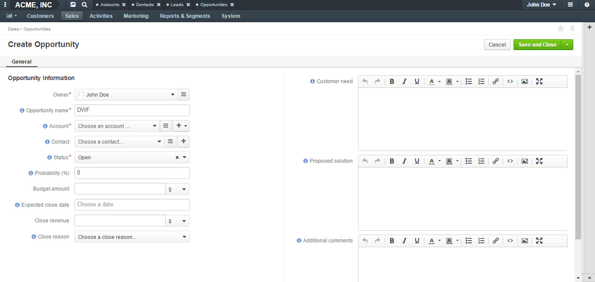
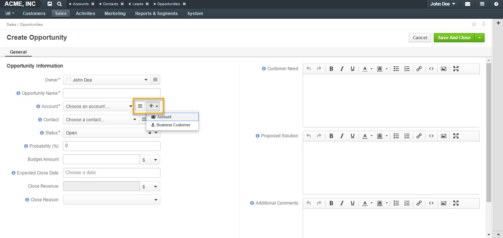
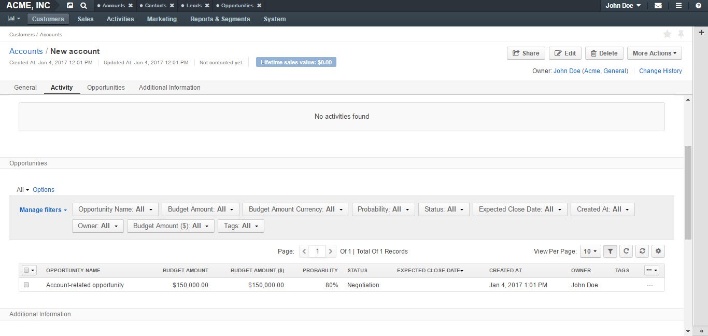
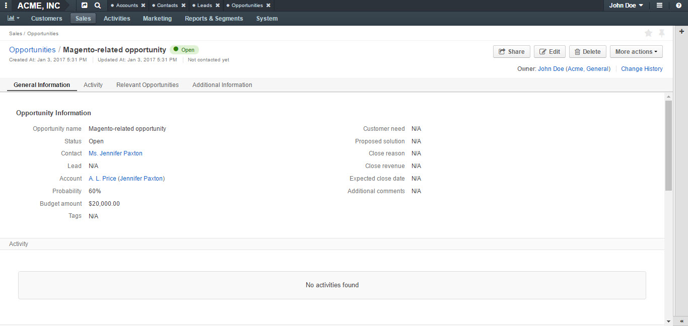

.. _user-guide-opportunities-create:

Create Opportunities
--------------------

.. begin_create_an_opportunity

Opportunities can be related to any customer type: Magento, OroCommerce or customers introduced by various third-party extensions. Business customers will remain available as legacy for users who upgrade from OroCRM 1.10 edition but will be deprecated in OroCRM 2.0.

Opportunities can also be :ref:`related directly to accounts <user-guide-opportunities-create--relate-to-account>`.  This is the simplest OroCRM setup if you do not need to track multi-channel sales. You can always enable the additional complexity of multiple customer channels when the need arises.

You can create opportunities from all related entities (e.g., from :ref:`OroCommerce customer <user-guide-opportunities-create--from-orocommerce-customer>`, from :ref:`Magento customer <user-guide-opportunities-create--from-magento-customer>` view or :ref:`account <user-guide-opportunities-create--from-account>` view), :ref:`by converting a lead to an opportunity <user-guide-opportunities-create--convert-lead-to-opportunity>` and :ref:`by creating an opportunity manually <user-guide-opportunities-create--create-manually>`.

.. finish_create_an_opportunity

See the following topics for more information:

.. contents:: :local:

Create Opportunities from Related Entities
^^^^^^^^^^^^^^^^^^^^^^^^^^^^^^^^^^^^^^^^^^

It is possible to create opportunities from all related entities, such as Magento, OroCommerce customers and Accounts directly.

.. _user-guide-opportunities-create--from-orocommerce-customer:

OroCommerce Customer
~~~~~~~~~~~~~~~~~~~~

To create an opportunity from a Commerce customer view page, make sure you have the CRM features enabled in the system configuration.

-	Navigate to **Customers** in the main menu, click **Commerce Customers**.
-	Select your customer and open their view page.
-	Click **More Actions** in the top right corner.
-	Click Create Opportunity in the dropdown.
-	A **Create Opportunity form** will open with an **Account** field pre-filled in with your selected Commerce customer.

.. image:: ../../../img/opportunities_2.0/commerce_customer_create_opp.jpg

.. image:: ../../../img/opportunities_2.0/commerce_opportunity_form.jpg

.. _user-guide-opportunities-create--from-magento-customer:

Magento Customer
~~~~~~~~~~~~~~~~

To create an opportunity from a Magento customer view page:

-	Go to **Customers** in the main menu, click **Magento Customers**.
-	Select a Magento customer from the grid and open their view page.
-	Navigate to **More Actions** in the top right corner.
-	Click **Create Opportunity** from the list.
-	A **Create Opportunity form** will open with an **Account** field already filled in with your selected Magento customer.

.. image:: ../../../img/opportunities_2.0/magento_customer_create_opportunity.jpg

.. image:: ../../../img/opportunities_2.0/magento_customer_create_opportunity_form.jpg

.. _user-guide-opportunities-create--from-account:

Account
~~~~~~~

To create an opportunity directly from an account view page:

-	Go to **Customers>Accounts** in the main menu.
-	Click on the required account in the grid.
-	Navigate to **More Actions** in the top right corner.
-	Select **Create Opportunity** from the list.
-	A **Create Opportunity form** will open with an **Account** field already filled in with your selected account.

.. image:: ../../../img/opportunities_2.0/account_opportunity.jpg

.. _user-guide-opportunities-create--convert-lead-to-opportunity:

Convert Lead to Opportunity
^^^^^^^^^^^^^^^^^^^^^^^^^^^

As soon as a lead is ready to be qualified, it can be converted into an opportunity.

This can be done by:

-	Navigating to **Sales>Leads** in the main menu.
-	Opening a lead from the grid.
-	Clicking **Convert Lead to Opportunity** on the lead page.

.. image:: ../../../img/opportunities_2.0/convert_to_opportunity_button.png

-	**Convert Lead To Opportunity form** will emerge.

.. image:: ../../../img/opportunities_2.0/convert_to_opportunity_2.0.jpg

More information on leads can be found in :ref:`this <user-guide-system-channel-entities-leads>` this section of the guide.

.. _user-guide-opportunities-create--create-manually:

Create Opportunity Manually
^^^^^^^^^^^^^^^^^^^^^^^^^^^

To create an opportunity manually:

-	Go to **Sales>Opportunities** in the main menu.
-	Click **Create Opportunity** in the top right corner.
-	The **Create Opportunity form** will appear.

Fill in the form
^^^^^^^^^^^^^^^^

.. _user-guide-opportunities-create--create-form:

Create an Opportunity Form
~~~~~~~~~~~~~~~~~~~~~~~~~~

To create a new opportunity manually:

-	Navigate to **Sales>Opportunities**.
-	Click **Create Opportunity** in the top right corner of the page.
-	A **Create Opportunity form** will open with a number of fields to be defined.

.. image:: ../../../img/opportunities_2.0/create_opp_new.jpg

.. csv-table::
  :header: "Field", "Description"
  :widths: 10, 30

  "**Owner**", "Limits the list of users who can manage the opportunity to users, whose roles allow managing opportunities assigned to the owner (e.g. the owner, members of the same business unit, system administrator, etc.). By default, the user creating the record is chosen."
  "**Opportunity Name**", "The name used to refer to an opportunity in the system."
  "**Account**", "Allows to select or create a customer account the opportunity will be related to.

 	-	Account field will be filled in with the company name if such name was entered when creating a lead.

	-	To create a new account, click **+** at the end of the Account field.

	-	Alternatively, use write-in functionality to enter a new account name. Type the name in the field and click **Add New Account**.

  You can find more information on Account relation further below this guide."
  "**Contact**", "The person on the customer side who is directly related to the opportunity."
  "**Status**", "A stage in the process of a sale. **Open**, **Closed Won** and **Closed Lost** are system statuses that cannot be deleted.  Other statuses can be added and customized in the system configuration settings by an admin."

.. image:: ../../../img/opportunities_2.0/status.jpg

.. csv-table::
  :header: "Field", "Description"
  :widths: 10, 30

  "**Probability**", "The perceived probability of an opportunity being successfully closed.

  Probability is related to **Status**. For each status, there is a certain percentage of probability which is pre-configured automatically.

  To configure percentage for each status (see the first screenshot below):

  -	Go to **Systems>Configuration**.
  -	Open **CRM** tab.
  -	Click **Opportunities**.
  -	Configure statuses in the **Probabilities** section.

  Here, you can add new statuses by clicking **+Add**, changes status names, their position and probability percentage.

  **Note** that you cannot change probability percentage for **Open**, **Closed Won** and **Closed Lost** system statuses.

  Probability percentage can be edited manually when filling in the **Convert To Opportunity form** (as illustrated in the second screenshot below)."

.. image:: ../../../img/opportunities_2.0/system_config_opportunities.png

.. image:: ../../../img/opportunities_2.0/probability_edited.png

.. csv-table::
  :header: "Field", "Description"
  :widths: 10, 30

  "**Budget Amount**", "Budget amount is potential deal value being discussed. For OroCRM Enterprise Edition, you can select the currency of the deal. The currencies available in the dropdown will depend on your system configuration. You can find more on multi-currency functionality further below this guide."
  "**Expected Close Date**", "Expected close date of the deal."
  "**Close Revenue**", "The amount actually received as the result of the deal.

  E.g. If the predicted budget was $10 000 but the result of the deal was $500 lower than the budget amount, the close revenue would constitute $9 500."
  "**CLose Reason**", "The reason for closing the deal, e.g. won, outsold, cancelled, etc."
  "**Customer Need**", "Enter customer needs if known."
  "**Proposed Solution**","Enter your offers and/or solutions for the customer if any were proposed."
  "**Additional comments**","Enter additional comments if necessary."

.. _user-guide-opportunities-create--convert-form:

Convert to Opportunity Form
~~~~~~~~~~~~~~~~~~~~~~~~~~~

**Convert To Opportunity Form** contains **Opportunity Information** and **New Contact Information** forms.

For **Opportunity Information**, the fields to be defined are the same as the ones in the Create an Opportunity form (see the section above).

**New Contact Information** Form contains **General**, **Contact Details** and **Addresses** sections with a number of fields to fill in.

Since the lead has fulfilled its purpose and is no longer needed, a new contact will be created based on lead data entered in this form.

It is possible to enter **multiple** phones, emails and addresses for an opportunity. You can choose which phone, email or address is to be primary. You can also delete the entered phone, email or address by clicking **X** on the right of the corresponding fields (as shown in the screenshot below).

.. image:: ../../../img/opportunities_2.0/contact_info_form_1.png

.. image:: ../../../img/opportunities_2.0/contact_info_form_2.png

.. note:: Within the opportunity grid, only one phone, email and address will be displayed, even if multiple phones, emails and addresses have been entered.

Once you have completed filling in the forms, click **Save and Close** to save the opportunity in the system.

.. _user-guide-opportunities-create--relate-to-account:

Relate Opportunity to an Account
~~~~~~~~~~~~~~~~~~~~~~~~~~~~~~~~

Opportunities can be related to any customer type, e-commerce or not, such as Magento, Prestashop, OroCommerce and such like.
In the simplest OroCRM setup, when you do not need the complexity of multi-channel sales, opportunities can be related directly to accounts. In this context, it is not recommended to use customers when selecting an account in the Opportunity Information form, since your customers will be represented by an account entity.

You can search for an account or create a new one.

.. image:: ../../../img/opportunities_2.0/account_related_opportunity.jpg

Account view page will display opportunities related to a particular account in the **Action** section. Lifetime sales value will be calculated based on the values of the opportunities related to an account.

Let us have a look at a more complex context when you need to track multi-channel sales. For instance, if you have different Magento stores and different Magento customers in every store and you wish to track your sales via sales opportunities and create opportunities related to specific Magento customers. In the following example, we have created a new opportunity related to a Magento customer:

.. image:: ../../../img/opportunities_2.0/account_magento_customer.jpg

In the **Account** dropdown, you will see groups of accounts and customers. Each group will have at least one account. The types of the customers displayed in the dropdown will depend on the active channels in your system. The customers will be identified by the corresponding logo.

In the given example, there is an option to relate the opportunity to an *A.L.Price account* and the customer (from 2 Magento channels) that belongs to the account.

Accounts can be searched for not only by their account name but also contact name, email or phone.

.. image:: ../../../img/opportunities_2.0/account_search_by_contact.jpg

Once saved, this opportunity will be related to an account via a customer.

