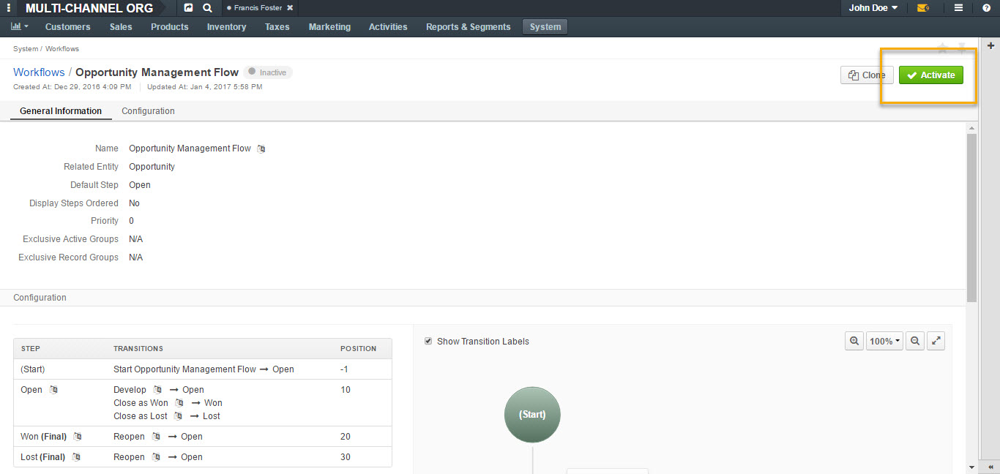
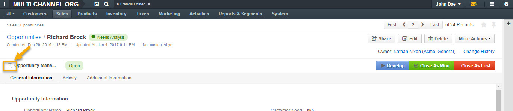

.. begin_opportunity_flows

Manage Opportunity Workflow
---------------------------

You can use OroCRM’s workflows to define rules and guidelines on possible actions/updates of opportunities in the system.

It is possible to have multiple active workflows for the same entity at the same time (e.g.: alternative sales workflows that the sales representative can choose when they decide how to deal with an opportunity; parallel sales follow-up and order fulfillment workflows for a placed order, etc.).

In the following example, we have two workflows for Opportunity active at the same time (Opportunity Management Flow and Opportunity Support Flow).

.. image:: ../../../img/opportunities_2.0/multiple_flows.jpg

Activate Opportunity Management Flow
^^^^^^^^^^^^^^^^^^^^^^^^^^^^^^^^^^^^

To ensure data consistency and reasoned opportunity management by a sales manager, you can activate Opportunity Management Flow in **System>Workflows**.

This can be done from the **Workflows** view page by selecting Opportunity Management Flow and clicking :guilabel:`Activate` in the top right corner.

Active Opportunity Management Flow limits what a sales manager can do with opportunities, thus eliminating situations when, for instance, an opportunity is not yet closed but its close reason is specified, or an opportunity is closed but its close reason is unspecified.

Start Opportunity Management Flow
^^^^^^^^^^^^^^^^^^^^^^^^^^^^^^^^^

Activating Opportunity Management Flow does not happen automatically for all opportunities. Once the flow has been activated in **System>Workflows**, you need to start it manually for the required opportunities.

It is possible to have multiple active workflows for the same record. If you have more than one active workflow, you can separately activate each of them. In the following example, two workflows are available for one opportunity record:

.. image:: ../../../img/opportunities_2.0/start_opp_managemtn_flow_manually.jpg

You can set Opportunity Status and Probability manually before starting Opportunity Management Flow.

.. image:: ../../../img/opportunities_2.0/stautus_probability_opp_flow.jpg

.. image:: ../../../img/opportunities_2.0/two_workflows_active.jpg

Manage Multiple Workflows
^^^^^^^^^^^^^^^^^^^^^^^^^

Workflows are expandable and can be collapsed if necessary by clicking on the :guilabel:`+` button on the left of the Workflow as illustrated below:

.. image:: ../../../img/opportunities_2.0/collapse_flow_2.jpg

Transitions
^^^^^^^^^^^

The type of the transitions displayed for opportunities will depend on the type of the workflow enabled.

The following transitions will become available as the result of Opportunity Management flow activation:

-	Develop
-	Close As Won
-	Close As Lost

Close As Won/Close As Lost
~~~~~~~~~~~~~~~~~~~~~~~~~~

**Close Revenue** and **Close Reason** fields and statuses have become unavailable in the edit opportunity form as the result of flow activation.

.. image:: ../../../img/opportunities_2.0/inactive_close_reason.jpg

To close an opportunity as Won or Lost, use **Close As Won/Close As Lost** transition buttons instead. They are located at the top of Opportunities view page.

|

.. image:: ../../../img/opportunities_2.0/transitions.jpg

Note that it is not possible to close an opportunity from the grid, although inline editing as a feature is available after flow activation.

To close an opportunity as Won:

-	Click :guilabel:`Close As Won`.
-	Enter **Close Revenue**.
-	Enter **Expected Close Date**.
-	Click :guilabel:`Submit`.

To close an opportunity as Lost:

-	Click :guilabel:`Close As Lost`.
-	Select **Close Reason** from the dropdown.
-	Select the **Expected Close Date**.
-	Click :guilabel:`Submit`.

Develop
~~~~~~~

Develop transition is a simplified form for editing an opportunity.

.. image:: ../../../img/opportunities_2.0/develop.jpg

Other
~~~~~

Depending on their configuration, workflow steps can vary. Here is an example of the steps and transitions configured for the Opportunity Support flow.

.. image:: ../../../img/opportunities_2.0/wf_steps.jpg

.. image:: ../../../img/opportunities_2.0/wf_steps_2.jpg

.. image:: ../../../img/opportunities_2.0/wf_steps_3.jpg

OroCommerce Opportunity Flow
^^^^^^^^^^^^^^^^^^^^^^^^^^^^

OroCommerce Opportunity Flow allows sales reps to create `quotes <https://www.oroinc.com/doc/orocommerce/current/user-guide/quotes>`__ directly from the opportunity view page. All quotes created within a specific opportunity are displayed in the corresponding section of its view page. The sales rep can manage quotes from this grid in the same way they can manage them from the quotes grid (e.g. edit or delete).

.. note:: Creating a quote from the opportunity view page is only available if opportunity is related to a Commerce customer. Otherwise, the workflow will behave exactly like the standard Opportunity Management flow (for standard flow, see the `Manage Opportunity Workflow`_ section of the guide).

When OroCommerce Opportunity flow is activated in **System>Workflows** and an opportunity is related to a Commerce customer, the :guilabel:`Create Quote` button will appear in the top right corner of the opportunity view page.

.. note:: Creating a quote from the opportunity view page is only available for **open** opportunities, i.e. not closed or lost.

.. image:: ../../../img/opportunities_2.0/commerce_flow.png

.. image:: ../../../img/opportunities_2.0/create_quote.png

Click :guilabel:`Create Quote` to start creating a new quote.

When a quote is created and saved, the following information will appear on the opportunity page:

- A **Quote Created** note next to the OroCommerce Opportunity Flow name.
- A **Quotes** section with details of the created quote.

From the opportunity view page, the following actions are possible for the quote:

- View: |IcView|
- Edit: |IcEdit|
- Delete: |IcDelete|
- Expire: |IcExpire|

.. note:: Note that availability of the **Expire** option for a quote within the opportunity view page depends on the types of workflows activated in your system.

.. image:: ../../../img/opportunities_2.0/quote_created_opp.png

On the Quote view page, relation to the opportunity, which this quote has been created from, will remain, as illustrated in the following screenshot:

.. image:: ../../../img/opportunities_2.0/quote_opp.png

.. image:: ../../../img/opportunities_2.0/quote_opp_edit.png

You can create any number of quotes for one open opportunity.

.. finish_opportunity_flows

.. include:: /img/buttons/include_images.rst
   :start-after: begin

.. |IcExpire| image:: /img/buttons/IcExpire.png
   :align: middle
