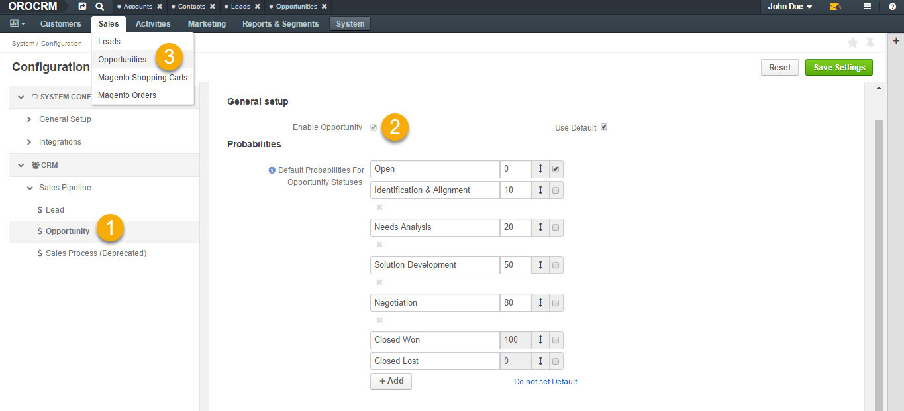

.. _user-guide-system-channel-entities-opportunities:

Opportunities
=============

.. contents:: :local:
    :depth: 1

Overview
--------

Opportunities are highly probable potential or actual sales to a new or established customer. Request for proposal, invitation for a bidding, agreement of intentions or order for a delivery can be saved as opportunities. These are a universal sales tracking tool that can be related to virtually any customer type.

In the following guide, you will learn how to:

-	:ref:`Enable <user-guide-system-channel-entities-opportunities--enable>`, :ref:`create <user-guide-system-channel-entities-opportunities--create-intro>` and :ref:`manage <user-guide-system-channel-entities-opportunities--manage-intro>` opportunities
-	:ref:`Manage opportunity workflow <user-guide-system-channel-entities-opportunities--manage-flow-intro>`
-	Work with :ref:`reports for opportunities <user-guide-opportunities-reports-intro>`

.. note:: See a short demo on `how to create and work with opportunities <https://oroinc.com/orocrm/media-library/create-work-opportunity>`_, or keep reading the step-by-step guidance below.

   .. raw:: html

      <iframe width="560" height="315" src="https://www.youtube.com/embed/662N4sMvyvc" frameborder="0" allowfullscreen></iframe>

.. _user-guide-system-channel-entities-opportunities--enable:

Enable Opportunities
--------------------

You can enable (or disable) an opportunity manually the following way:

-	Navigate to **Settings>Configuration** in the main menu.
-	Open **CRM>Sales Pipeline** in the left menu and click :guilabel:`Opportunity`.
-	In the **General Setup** section, check the **Enable Opportunity** box.

Enabling opportunity as a feature adds the opportunity entity to **Sales** in the main menu.

.. note:: Please refer to your administrator if you have insufficient permissions to enable/disable opportunities in your application.

.. _user-guide-system-channel-entities-opportunities--create-intro:

Create an Opportunity
---------------------

.. include:: create.rst
   :start-after: begin_create_an_opportunity
   :end-before: finish_create_an_opportunity

See detailed guidance in the :ref:`Create Opportunities <user-guide-opportunities-create>` topic.

.. include:: view.rst

.. _user-guide-system-channel-entities-opportunities--manage-intro:

.. include:: manage.rst
   :start-after: begin_manage_opportunities
   :end-before: finish_manage_opportunities

.. _user-guide-system-channel-entities-opportunities--manage-flow-intro:

.. include:: flows.rst
   :start-after: begin_opportunity_flows
   :end-before: finish_opportunity_flows

.. include:: multi-currency.rst
   :start-after: begin_multi_currency_opportunities
   :end-before: finish_multi_currency_opportunities

.. _user-guide-opportunities-reports-intro:

.. include:: reports.rst
   :start-after: begin_opportunity_reports
   :end-before: finish_opportunity_reports

Export an Opportunity
---------------------

You can export the opportunity details in the .csv format following the :ref:`Exporting Bulk Items <export-bulk-items>` guide.

Import an Opportunity
---------------------

You can import the bulk details of updated or processed opportunity information in the .csv format following the steps described in the :ref:`Importing Opportunities <import-opportunities>` guide.

.. BCrLOwnerClear| image:: /img/buttons/BCrLOwnerClear.png
   :align: middle

.. include:: /img/buttons/include_images.rst
   :start-after: begin

.. toctree::
   :hidden:

   create

   view

   manage

   flows

   multi-currency

   reports
